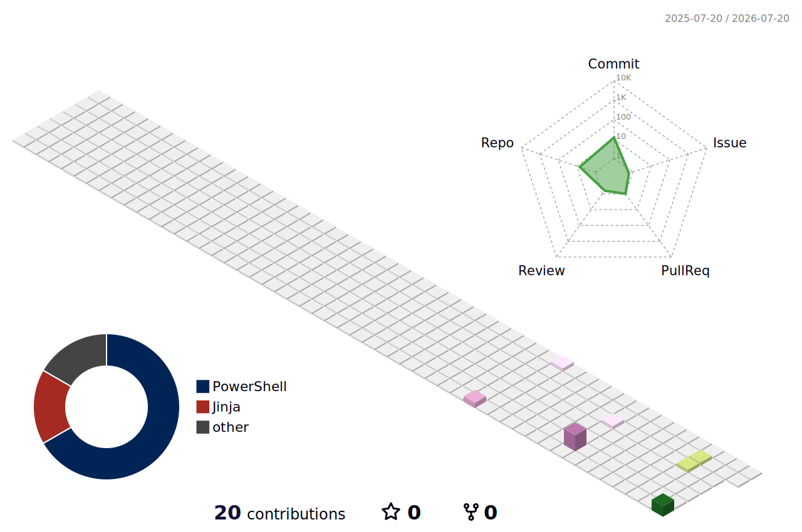

  

---

## À propos

Sysadmin et réseau depuis plus de trois ans (114 postes sur 4 sites : GLPI, Intune, Entra ID), en transition vers un poste de Security Engineer, direction Montréal. Côté sécurité, je travaille sur Azure Security, Microsoft Sentinel, Defender XDR, KQL et Terraform, avec un lab SOC complet déployable en Terraform. Certifications en cours : CompTIA A+, puis AZ-500 et SC-200.

Mon homelab tourne sous Ansible et mes tâches Active Directory passent par PowerShell. Dernier projet en date, un peu à part : PlaneAlert, une app macOS écrite en Swift pendant un hackathon.

---

## Projets

---

## Stack

  

---

## Stats GitHub

  
  

  

  

  

---

## Snake

<picture>
  <source media="(prefers-color-scheme: dark)" srcset="https://raw.githubusercontent.com/AymerickVic/AymerickVic/output/github-snake-dark.svg" />
  <source media="(prefers-color-scheme: light)" srcset="https://raw.githubusercontent.com/AymerickVic/AymerickVic/output/github-snake.svg" />
  
</picture>

---

## Arcade

Six jeux régénérés deux fois par jour à partir de ma grille de contributions.

### Pac-Man

<picture>
  <source media="(prefers-color-scheme: dark)" srcset="https://raw.githubusercontent.com/AymerickVic/AymerickVic/output-arcade/pacman-contribution-graph-dark.svg" />
  <source media="(prefers-color-scheme: light)" srcset="https://raw.githubusercontent.com/AymerickVic/AymerickVic/output-arcade/pacman-contribution-graph.svg" />
  
</picture>

### Breakout

<picture>
  <source media="(prefers-color-scheme: dark)" srcset="https://raw.githubusercontent.com/AymerickVic/AymerickVic/output-arcade/breakout-contribution-graph-dark.svg" />
  <source media="(prefers-color-scheme: light)" srcset="https://raw.githubusercontent.com/AymerickVic/AymerickVic/output-arcade/breakout-contribution-graph.svg" />
  
</picture>

### Galaga

<picture>
  <source media="(prefers-color-scheme: dark)" srcset="https://raw.githubusercontent.com/AymerickVic/AymerickVic/output-arcade/galaga-contribution-graph-dark.svg" />
  <source media="(prefers-color-scheme: light)" srcset="https://raw.githubusercontent.com/AymerickVic/AymerickVic/output-arcade/galaga-contribution-graph.svg" />
  
</picture>

### Puzzle Bobble

<picture>
  <source media="(prefers-color-scheme: dark)" srcset="https://raw.githubusercontent.com/AymerickVic/AymerickVic/output-arcade/puzzle-bobble-contribution-graph-dark.svg" />
  <source media="(prefers-color-scheme: light)" srcset="https://raw.githubusercontent.com/AymerickVic/AymerickVic/output-arcade/puzzle-bobble-contribution-graph.svg" />
  
</picture>

### Bomberman

<picture>
  <source media="(prefers-color-scheme: dark)" srcset="https://raw.githubusercontent.com/AymerickVic/AymerickVic/output-arcade/bomberman-contribution-graph-dark.svg" />
  <source media="(prefers-color-scheme: light)" srcset="https://raw.githubusercontent.com/AymerickVic/AymerickVic/output-arcade/bomberman-contribution-graph.svg" />
  
</picture>

### Minesweeper

<picture>
  <source media="(prefers-color-scheme: dark)" srcset="https://raw.githubusercontent.com/AymerickVic/AymerickVic/output-arcade/minesweeper-contribution-graph-dark.svg" />
  <source media="(prefers-color-scheme: light)" srcset="https://raw.githubusercontent.com/AymerickVic/AymerickVic/output-arcade/minesweeper-contribution-graph.svg" />
  
</picture>

---

## Contributions en 3D

<picture>
  <source media="(prefers-color-scheme: dark)" srcset="profile-3d-contrib/profile-night-rainbow.svg" />
  <source media="(prefers-color-scheme: light)" srcset="profile-3d-contrib/profile-season-animate.svg" />
  
</picture>

