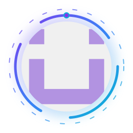

# Aymerick Victoire

**Sysadmin &amp; Réseau → Security Engineer**
Azure Security · Microsoft Sentinel · Automatisation · Montréal

---

## À propos

Sysadmin et réseau depuis plus de trois ans (114 postes sur 4 sites : GLPI, Intune, Entra ID), en transition vers un poste de Security Engineer, direction Montréal.

Côté sécurité je travaille sur Azure Security, Microsoft Sentinel, Defender XDR, KQL et Terraform, avec un lab SOC complet déployable en Terraform. Mon homelab tourne sous Ansible et mes tâches Active Directory passent par PowerShell.

Certifications : SC-300 (Identity &amp; Access Administrator) le 17 septembre 2026, puis AZ-104, SC-500 (Cloud &amp; AI Security Engineer) et SC-200.

---

## Stack

---

## Projets

| Projet | Description |
| --- | --- |
| [soc-quest](https://github.com/AymerickVic/soc-quest) | Parcours Security Engineer — Azure Security, KQL, Sentinel, Terraform, Entra ID |
| [sysadmin-toolkit](https://github.com/AymerickVic/sysadmin-toolkit) | Scripts PowerShell AD, playbooks Ansible et docs infra issus d'un lab réel |
| [entra-bulk-users](https://github.com/AymerickVic/entra-bulk-users) | Création en masse d'utilisateurs Entra ID depuis un CSV via Microsoft Graph |
| [ansible-homelab](https://github.com/AymerickVic/ansible-homelab) | Playbooks Ansible pour la gestion automatisée d'un homelab |
| [plane-alert](https://github.com/AymerickVic/plane-alert) | App macOS (Swift, EventKit) : une banderole passe 5 min avant chaque événement Calendrier |

---

## Activité

  

<picture>
  <source media="(prefers-color-scheme: dark)" srcset="https://raw.githubusercontent.com/AymerickVic/AymerickVic/output/github-snake-dark.svg" />
  <source media="(prefers-color-scheme: light)" srcset="https://raw.githubusercontent.com/AymerickVic/AymerickVic/output/github-snake.svg" />
  
</picture>

